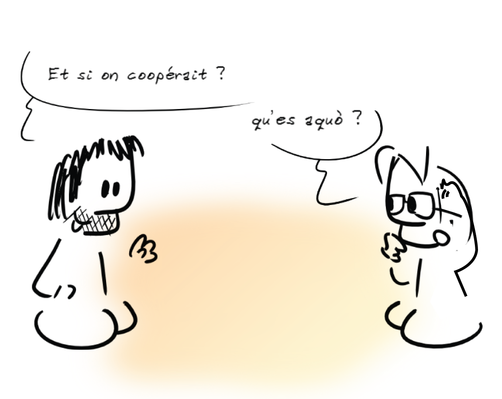

> "L’un des problèmes de base auquel le monde est confronté est celui de la coopération. Que veut dire le mot « coopération » ? Coopérer, c’est faire des choses ensemble, les construire ensemble, les ressentir ensemble, c’est avoir un objectif commun de manière à pouvoir travailler ensemble librement."  
**Jiddu Krishnamurti, philosophe indien.**
---
#Coopérer ?

##Effet de mode ou nécessité ?
Nouveau mot-clef à insérer dans nos dossiers pour qu’ils soient retenus ou changement de posture nécessaire ?  
Nouveauté ou simple ré-affirmation de ce qui fait l'humanité ?  

Amusez-vous à analyser les informations déversées par les journaux télévisés, il est possible que les quelques dysfonctionnement dont vous serez spectateurs aient tous, de prés ou de loin, comme cause première, une histoire de non coopération :  

* non coopération entre l’homme et son environnement,  
* non coopération entre l’homme et son prochain,  
* non coopération de l’homme avec lui-même.  

Même si la coopération n’est pas la panacée, il est certain que monter le curseur de la coopération dans nos projets, pour résoudre les enjeux auxquels nous sommes confrontés, semble être aujourd’hui une nécessité impérieuse.

Or, savoir coopérer est une des compétences orphelines des systèmes éducatifs. Autant nous avons appris à ne pas copier, à faire seul, à être classés les uns par rapport aux autres, autant le faire ensemble, la capacité à négocier, le “laisser une place pour l’autre” ont trop souvent été laissés pour compte.

L’objectif de ce petit opuscule est de vous proposer des cadres théoriques, quelques méthodes et outils pour vous donner envie de faire monter le curseur de la coopération autour de vous.
Commencez petit, distillez de “petites expériences irréversibles de coopération”, vous verrez, le virus prend vite.  

Pour aller plus loin, le site [ebook.coop-tic.eu](http://ebook.coop-tic.eu/ "Cliquez ici pour accéder à l'ebook"), résultat d’un projet européen Léonardo destiné à former des formateurs à l’animation de projets coopératifs, est fait pour vous. Il est pillable et photocopiable, comme cet ouvrage, sous les conditions de la licence Creative Commons BY-SA.  

Pour terminer, nous sommes convaincus que la marge de progression concernant la compréhension des conditions favorisant la coopération est énorme. N’hésitez donc pas à analyser vos pratiques, à les partager, à les diffuser…   

Il est possible qu’à plusieurs, nous soyons moins bêtes que tout seul.  

